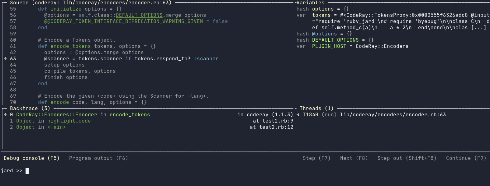

# RubyJard

Jard stands for Just Another Ruby Debugger. It implements a layer of UI wrapping around byebug, aims to provide a unified experience when debug Ruby source code. Ruby Jard supports the following major features at the moment:

* Default Terminal UI, in which the layout and display are responsive to support different screen size.
* Highlighted source code screen.
* Stacktrace visulization and navigation.
* Auto explore and display variables in the current context.
* Multi-thread exploration and debugging.

In the roadmap:
* Dynamic breakpoints.
* Watch expressions.
* Support different screen sizes.
* Minimal layout configuration.
* Fully layout configuration with Tmux .
* Integrate with Vim .
* Integrate with Visual Studio Code .
* Encrypted remote debugging .
* Some handful debug tools and data visulization.

Ruby Jard's core is Byebug, an awesome de factor debugger for Ruby. Therefore, Ruby Jard supports most of Byebug's functionalities.

If you still don't know what it is, let's watch this video. This is a record of debugging Code Ray - A syntax highlighter for Ruby.

[](https://asciinema.org/a/ejWK3Px55QNQmhM4nbd1lSigW)

## Getting Started

**Warning**: Ruby Jard is still under heavy development. Bugs and weird behaviors are expected. If you see one, please don't hesitate to open an issue. I'll try my best to fix.

Add `ruby_jard` to your Gemfile, recommend to put it in test or development environment.

``` ruby
gem 'ruby_jard'
```

Add magic method `jard` before the line you want to debug, just like `byebug`

```ruby
def test_method
  a = 1
  b = 2
  jard # Debugger will stop here
  c = a + b
end
```

## Guides



The main page of the debugging UI includes 4 screens:
- Source: Show the current file, surrounding source code of executing line.
- Stacktrace: Show the current thread's stacktrace. You can use `up`, `down`, `frame` to navigate through the stacktrace.
- Variables: Show all the variables in the current context, including local variables, instance variables and constants.
- Threads: Show all the threads of the process. This screen is valuable in case you are debugging a multi-threaded program.

At this alpha state, Ruby Jard support some basic commands:
- `next`: continue the execution to the next line.
- `step`: continue the execution, do deep into the implementation of methods in the current line.
- `continue`: continue the execution. The program gonna stops at the next break point.
- `finish`: Finish the execution of current frame, and go back.
- `up`: explore the stacktrace, jump to the upper frame of current program
- `down`: explore the stacktrace, jump to the lower frame of current program
- `frame`: explore the stacktrace, jump to a precise frame in the stacktrace.

## Contributing

Bug reports and pull requests are welcome on GitHub at https://github.com/[USERNAME]/ruby_jard. This project is intended to be a safe, welcoming space for collaboration, and contributors are expected to adhere to the [code of conduct](https://github.com/[USERNAME]/ruby_jard/blob/master/CODE_OF_CONDUCT.md).


## License

The gem is available as open source under the terms of the [MIT License](https://opensource.org/licenses/MIT).

## Code of Conduct

Everyone interacting in the RubyJard project's codebases, issue trackers, chat rooms and mailing lists is expected to follow the [code of conduct](https://github.com/[USERNAME]/ruby_jard/blob/master/CODE_OF_CONDUCT.md).
