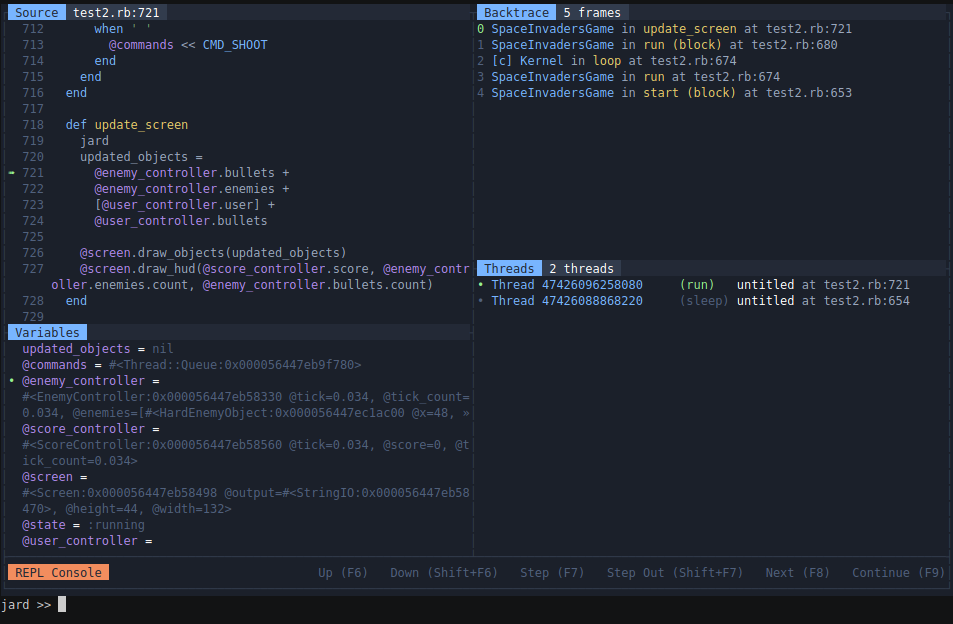
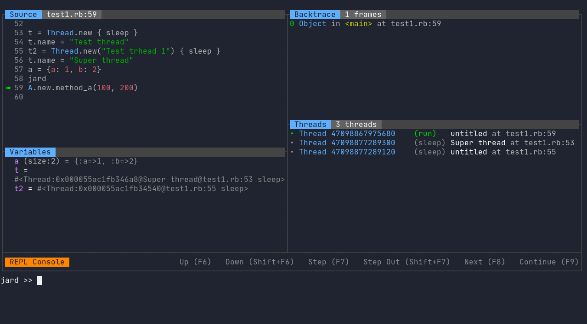
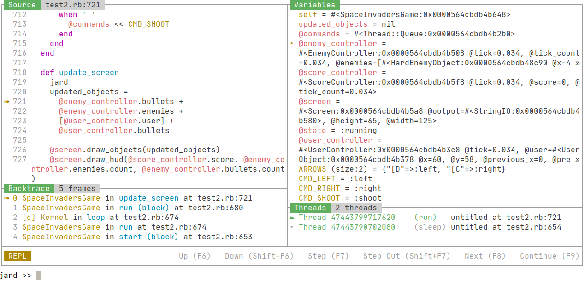
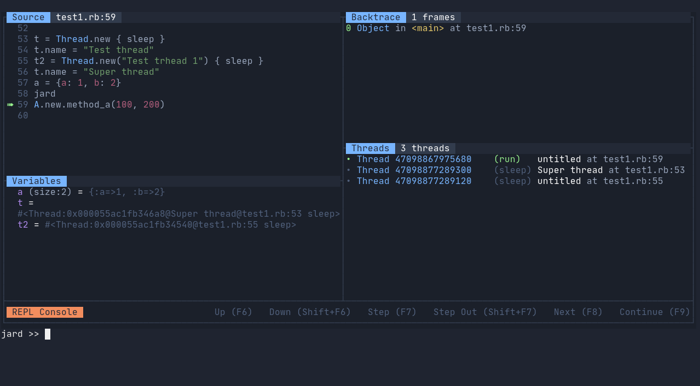
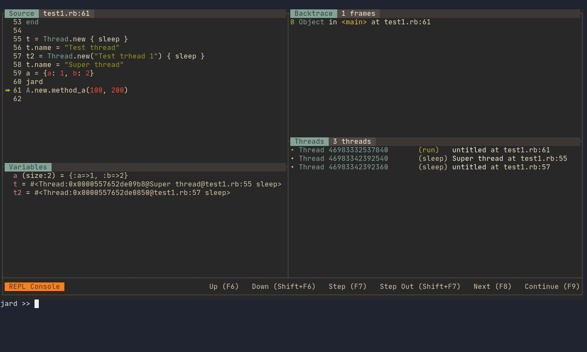
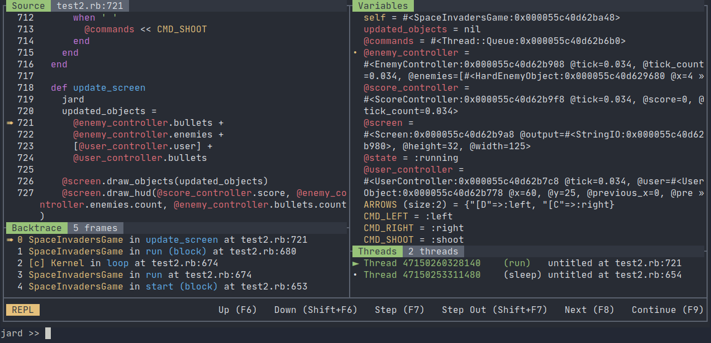
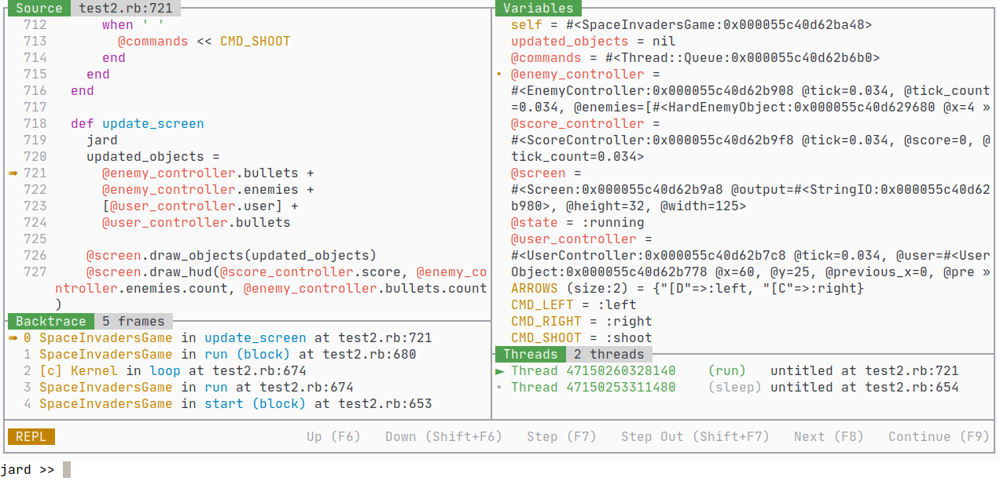

Jard stands for Just Another Ruby Debugger, aims to provide a better experience while debugging Ruby. Ruby Jard provides modular visual interfaces to show relevant information about your debugging program. Those interfaces are optimized for usability, and highly friendly to developers, especially new comers. They help you reduce the commands you need to type, the mental efforts wasted trying to navigate and grab the information you need. As a result, you can now focus more on the debug flow.

[](https://asciinema.org/a/350233)

*[(Click for demo video)](https://asciinema.org/a/350233)*

Ruby Jard's core is [Byebug](https://github.com/deivid-rodriguez/byebug), an awesome de factor debugger for Ruby. Therefore, Ruby Jard supports most of Byebug's functionalities.

## Getting Started

**Warning**: Ruby Jard is still under heavy development. Bugs and weird behaviors are expected. If you see one, please don't hesitate to open an issue. I'll try my best to fix.

Add `ruby_jard` to your Gemfile, recommend to put it in test or development environment.

``` ruby
gem 'ruby_jard'
```

Add magic method `jard` before the line you want to debug, just like `byebug`

```ruby
def test_method
  a = 1
  b = 2
  jard # Debugger will stop here
  c = a + b
end
```

## Screens

When Jard attaches at any line of code, the main tile-style UI shows up. By default, there are 5 areas on the UI that you'll be interested.

### Source panel


This panel shows the current line of code that your program is stopping, and surrounding related lines. The number of lines shown in this panel depends on your current terminal height, but never less than 5.

Ruby Jard supports any file extensions that your program runs into, especially `.rb`, `.erb`, `.haml` files. Other file types may encounter minor syntax highlighting issues.

Ruby Jard also supports inspecting gems and libraries, if you are interested.

### Backtrace panel


This panel describes the current backtrace of the current thread your program is stopping. Each line of this panel describes the current Frame. What is frame and backtrace by the way? Let's step back a little bit at how Ruby executes your code. Internally, Ruby uses an interpreter to read and execute your code, line by line (technically, YARD instructions, but let's go with a simple version). When it meets a chunk of code that needs to open a new scope, like method calls or inline-block call, the interpreter creates a new structure to store the current context so that it can link to the next scope and go back later. This data structure is call Frame. The interpreter pushes frame into a stack, called backtrace (or stack trace, or call stack, whatever), and continues to execute your code. Each thread has a separate backtrace. To understand deeply, you may be interested in this wonderful slide: [Grow and Shrink - Dynamically Extending the Ruby VM Stack](https://www.slideshare.net/KeitaSugiyama1/grow-and-shrink-dynamically-extending-the-ruby-vm-stack).

Overall, the whole backtrace panel lets you know where you are stopping at, the trace of how your program is running. When combining with other tools and other panels, you will be surprised by how much information the bugger can help you when you encounter your bugs.

Each frame includes the following information:

- Frame ID: incremental, can be used to jump to an arbitrary frame with frame command.
- Current location label: a class name and method name of the method covers its frame. If there is a `[c]` prefix in front of a class name, it means that the method is provided by Ruby, implemented in C, and impossible to peek.
- Current physical location: exact file name and line number. If a frame is allocated in a gem, the physical location shows a gem name and version only. For example: `RSpec::Core::Hooks::HookCollections in run in rspec-core (3.9.2)`.

### Variable panel


The variable panel lets you explore all the local variables, instance variables, and constants in the current display context. Each variable is described by:

- Inline indicator: the beginning dot (`•`) implies a variable that appears in the current line.
- Variable type: allow you to know the type of a variable at a single glance. Only built-in types, such as `int`, `flt`, `hash`, `bool`, `rng`, are supported. Instances of any classes will be noted as `var`.
- Size of variable: the size of collection-like variables. Current Jard version supports 3 types:
  - Hash: this field shows the number of keys
  - Array: this field shows the number of items
  - String: this field shows the number of character (fetched from`String#size` method)
- Variable inspection: the content of the variable. The current Jard version generates this field by calling `#inspect`. **Known issue**: this accidentally triggers materializing method of objects, such as `ActiveRecord::Relation`. Future Jard version gonna fix this by a new safe generator.

This panel interacts well with backtrace panel and backtrace-exploring commands such as (`up`, `down`, `frame`, etc.) to inspect relative variables at each frame layer in the program. A common use case is to recall the parameter values you forgot when digging too deep into a method call.

By default, the variables are sorted by the following criteria:

- Pinned variables (coming soon)
- Current context (self)
- Local variables
- Instance variables
- Constants
- Global variables (coming soon)

### Thread panel


Show all the threads running at the moment. This panel is useful when you are working with a complicated multi-threaded environment like web server, or background jobs.

### Repl panel


An interactive Repl for you to interact with your program, inspect values, update values, or control the debug flow as you want. The heart of Jard's repl is [Pry](https://github.com/pry/pry), a masterpiece gem. When you type a command, Jard parses, and does corresponding actions if what you type matches supported command. Otherwise, they are evaluated as Ruby code.

## Flow Commands

### List

**Repl command**: `list`

**Key binding:** F5

**Alias**: `l`, `whereami`

Refresh the whole terminal UI. This command doesn't move you to other steps, nor change any data in your session. It is useful (or the only way) to get back the beautiful UI if you type too much in the REPL console.

### Step

**Repl command**: `step`

**Key binding**: F7

**Alias**: `s`

**Examples:**

```
step     # Step once
step 3   # Step 3 times
```

Detect and step into a method call or block in the current line. If there isn't anything to step in, the program continues to next line. In case there are multiple methods on the same line, Jard hornors Ruby's execution order.

### Step out

**Repl command**: `step-out`

**Key binding**: Shift + F7

**Alias**: `so`

**Examples:**

```
step-out     # Step out once
step-out 3   # Step out 3 times
```

The opposite of step. This command is used to finish the execution of current frame, and jump to the next line of upper frame. In other words, this command is equivalent to the sequence `up` and `next`. If the neighbor frame already finishes, it continues with even higher frame.

This command is useful when you loose your interest in frame, and want to quickly go up again. One example is that you accidentally step into a longgggg loop with nothing useful. Another example is that you step into the library source code and don't really care what it does underlying.

### Next

**Repl command**: `next`

**Key binding**: F8

**Alias**: `n`

**Examples:**

```
next     # Next instruction
next 3   # Next 3 next instructions
```

Continue to the next line in the current frame, by pass any steppable method call or blocks in the mid way unless they contains dynamic breakpoint or any `jard` attachment command. If the current frame already reaches the end, it continues to the next line of upper frame and so on.

### Continue

**Repl command**: `continue`

**Key binding**: F9

**Alias**: `c`

Continue the execution of your program to the end, or stop at the first dynamic break point or `jard` attachment command. One common confusion is that long-running ruby processes, such as web server or background jobs, won't stop, and may be used to debug the next request without restarting. If you want to end everything and just exit the process, let's use `exit`.

### Up

**Repl command**: `up`

**Key binding**: F6

**Examples:**

```
up     # Move to upper frame
up 3   # Move to upper 3 frames
```

Explore the upper frame. When you use this command, all associated displaying screens will be updated accordingly, but your program current position is still at the latest frame. This command is mostly used to explore, and view the trace, input parameters, or how your program stops at the current position. When use this command, you should have a glance at Variable panel, and Source panel to see the variables at destination frame.

You can combine with `next` or `step` to perform powerful execution redirection at the destination frame. Let's look at an example. You are debugging a chain of 10 rack middlewares, you go deep into the #9 middleware, found something, then want to go back to #5 middleware. It's pretty boring and frustrated to just use `next` or `step-out` and hope it eventually goes back. Now use `up` for some times (or `frame`, described below) to go to your desired frame, and use `next` there. Tada, it's magical, just like teleport.

One note is that you cannot explore a frame in c.

### Down

**Repl command**: `down`

**Key binding**: Shift+F6

**Examples:**

```
down     # Move to lower frame
down 3   # Move to lower 3 frames
```

Explore the lower frame. See `up` command for more information.

### Frame

**Repl command**: `frame [-h] [frame_id]`

**Key binding:** None

**Examples:**

```
frame 0     # Jump to frame 0
frame 7     # Jump to frame 7
```

Explore a particular frame with id `<frame_id>`. It's faster than `up` and `down`. See `up` command for more information.

## Control commands

All control commands start with`jard` namespaces. This class of commands are used to control the visual interfaces, configuration, or specific operations provided by Jard.

### Color scheme

**Repl command**: `jard color-scheme [-l|-h] [frame_id]`

**Key binding:** None

**Examples:**

```
jard color-scheme -l # List all available color schemes
# Output:
# jard >>
# 256
# deep-space
# gruvbox
jard color-scheme deep-space # Switch to color scheme deep-space
```

List all available color schemes, or switch to a particular color scheme at runtime.

### Show

**Repl command**: `jard show [screen]`

**Key binding:** None

**Examples:**

```
jard show variables
jard show threads
```

Show a particular screen on the current interface. 

### Hide

**Repl command**: `jard hide [screen]`

**Key binding:** None

**Examples:**

```
jard hide variables
jard hide threads
```

Hide a particular screen from the current interface. 

### Output

**Repl command**: `jard output`

**Key binding:** None

**Examples:**

```
jard output
```

Show all the program output in a pager, allowing navigation, searching (powered by GNU Less). Note that the output are only captured only after Jard already started. All the previous output could not be captured.

## Color schemes

| Name                                                         | Screenshots                                                  |
| ------------------------------------------------------------ | ------------------------------------------------------------ |
| `256` <br />Default theme, 256 basic colors, supported by all terminals |  |
| `256-light`                                                  |  |
| `deep-space`                                                 |  |
| `gruvbox`                                                    |  |
| `one-half-dark`                                              |  |
| `one-half-light`                                             |  |


## Configuration

Ruby Jard supports customization via pre-loaded configuration files. You can configure Jard both globally, and per-project.

- The global configuration file is located at `~/.jardrc`.
- The project configuration file is located at `.jardrc` in working directory when you start Ruby Jard. Per-project ones will override, and merge with global ones.

There are some supported configurations:

| Name                | Description                                                  | Default |
| ------------------- | ------------------------------------------------------------ | ------- |
| `color_scheme`      | Choose your favorite color scheme. The list of color schemes can be looke up in [Color schemes session](#color-schemes), or from `jard color-scheme -l` command in REPL. | `256`   |
| `alias_to_debugger` | Use `debugger` instead of `jard` when debugging. | `false`   |

This is a complete example of a configuration file:

```ruby
config.color_scheme = "deep-space"
config.alias_to_debugger = true
```

## Roadmap

### [Done] Version 0.1.0: Proof of concept

This version is a bootstrap to see whether my idea works or not, in term of technical possibility and user usability. Luckily, everything works now, and I receive possible feedback from friends and peers.

### [Done] Version 0.2.0: UI completeness

The bootstrap version is just a series of ugly prints on stdout. It's frustrated as many things can be broken, wrong drawing, text overlapping, etc. This version is to fix those issues, and provide a foundation for more complicated drawing.

### Version 0.3.0: Complete the workflow

This version focuses on making Jard usable for daily activities of any developer. In other words, this version is to become a complete replacement for Byebug (sorry :pray:).

- Dynamic breakpoints.
- Watch expressions.
- Pin variables.
- Program's STDOUT panel.
- Post moterm.
- Trace variable changes.
- Multi-threaded debugging.
- Fulfill options for existing commands.
- Add more commands to control workflow.
- etc.

### Version 0.4.0: User satisfaction

Ruby Jard now serves well for all debugging use case. But it becomes floated, hard to use, and maybe just not "click" for the user. This version focuses on improve userability, stability, bugs, tweak small details. So that, after this version, Ruby Jard is just pleasant to use.

- Support different screen sizes.
- Minimal layout configuration.
- Allow customizations (keyboard shortcut for example).
- Rebuild variable inspection to optimize for each data type, especially nested complicated structure.
- Collapsible and expandale variable inspection.
- Windows, viewport, scrolling, etc.
- Navigate between panels.
- Build a buffer system to reduce interaction with STDOUT, and eventually improve drawing latency.

### Version 0.5.0: Integration

Accept or not, not everyone uses vim, or even terminal. Even in the terminal, I just want to provide minimal layout customizations, as I don't want to rebuild Tmux. Therefore, integration with other powerful systems to extend use cases, adapt different work flow and preferences is the focus on this version. I'm not sure about the ultimate solution, but at my limited knowledge now, [Debugger Adapter Protocol](https://microsoft.github.io/debug-adapter-protocol/) looks promising.

- Prepare the infrastructure for DAP protocol.
- Separate and split the panels into possible isolated processes, connect them together with DAP.
- Fully layout configurations and integrate with Tmux.
- Integrate with Vim 8+/Neovim via Terminal mode.
- Integrate with Visual Studio Code via DAP.
- Integrate with Emacs via dap mode.
- Encrypted remote debugging.

### Further future

I won't stop until 0.5.0 version, even Jard doesn't have any users. However, as soon as it reaches 0.5.0, and serves my interest well, I don't have much things in mind now. The future is uncertain. Dreaming is good. Making dreams come true is hard, and time-consuming. Hope I can reach that future.

## Contributing

Bug reports and pull requests are welcome on GitHub at https://github.com/nguyenquangminh0711/ruby_jard. This project is intended to be a safe, welcoming space for collaboration, and contributors are expected to adhere to the [code of conduct](https://github.com/nguyenquangminh0711/ruby_jard/blob/master/CODE_OF_CONDUCT.md).


## License

The gem is available as open source under the terms of the [MIT License](https://opensource.org/licenses/MIT).

## Code of Conduct

Everyone interacting in the RubyJard project's codebases, issue trackers, chat rooms and mailing lists is expected to follow the [code of conduct](https://github.com/[USERNAME]/ruby_jard/blob/master/CODE_OF_CONDUCT.md).
